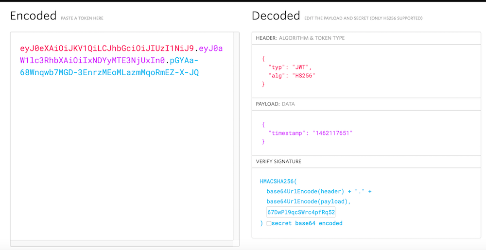

# Authentication of API Requests

When you access AppFriends REST API via our SDK, you only need to provide the correct **App_ID** and **App_Secret** when you initialize the SDK. However, when you want to make direct REST API requests using a http client, the requests need to be structured correctly and signed by the appropriate secret. `admin secret` can be used for all APIs, but you should only use it on your server to keep it secret. `app secret` is for you to use inside your app, and it can only give access to application APIs.

## Request Header
In the request http header, These fields need to be present:

`APP_ID` - Your App_ID. You can find it in the admin panel after your app is created there.

`TOKEN` - When you are sending the requests on a user's behave, the user's auth token should be included here. Auth token is returned after the user signup or login to AppFriends. See [user authentication](#user-authentication).

`Authorization` - Your request signature. See [signature creation](#signature-creation).

`Nonce` - A random integer.

`Timestamp` - system timestamp

### Sample Request Header
Your http header can contain other fields, but they need to include:

```
APP_ID: "SVXJKXjXUGOkEFBWDK8NCwtt"
TOKEN: "BE82LbEu_bGNnwXmy5KObw"
Timestamp: "1462117651"
Nonce: "<random integer>"
Authorization: Bearer <signature token>
```

## App ID and Secrets
For each application you create on AppFriends, there's going to an **App_ID**, an **App_Secret** and an **Admin_Secret**.

`App_ID` is used to identify your application.

`App_Secret` is the secret used to sign the requests coming from your application.

`Admin_Secret` is the secret used to sign the requests coming directly from your server. For example, your server can send a request via AppFriends REST API to update a user's token or you can export all the social graph data with your admin secret.

These values play very important role in authenticating your requests, so please keep them away from the bad guys.

## Signature Creation
The signature is creation is using JSON Web Tokens [(JWT)](https://jwt.io/), which is an open, industry standard [RFC 7519](https://tools.ietf.org/html/rfc7519) method for representing claims securely between two parties. You can use [this website](https://jwt.io/) to verify your signature.

```javascript
//signature creation
HMACSHA256(
  base64UrlEncode(JWT header) + "." +
  base64UrlEncode(payload),
  <your secret here>
)
```
The signature created here will be used in the Authorization header using the Bearer schema.

	Authorization: Bearer <signature token>

### JWT Header
JWT header is not your request http header. It is used just to sign the request. The JWT header will look like this:

```json
{
  "alg": "HS256",
  "typ": "JWT"
}
```
### JWT Payload
Put timestamp (seconds) in your payout
```json
{
  "timestamp": "1462117651",
  "token": "the user token"
}
```


*Above: JWT example on [jwt.io](https://jwt.io/)*


  
