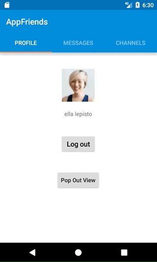

# AppFriends UI Customization
AppFriends Android SDK's UI components provide a set of tools for easy styling which can be configured and customized to match your app's style guide through style configurations as well as overriding XML attribute.

If you are using Simple or Embedded mode in the [UI Guide](ui.md), overriding the AppFriends' default style attributes is the simplest customization option.

Below is a simple example of styling the pop out view with the resulting visual effects compared to the standard view.

```
<style name="AppFriends.DialogList">
   <item name="dialogTitleTextColor">@android:color/holo_red_light</item>
   <item name="dialogUnreadTitleTextColor">@android:color/holo_red_light</item>
   <item name="dialogUnreadTitleTextStyle">italic</item>
</style>

<style name="AppFriends.Toolbar">
   <item name="android:textColorPrimary">@android:color/white</item>
   <item name="android:textColorSecondary">@android:color/background_dark</item>
   <item name="android:background">@color/orange</item>
   <item name="colorControlNormal">#FF0000</item>
</style>

<style name="AppFriends.Popup">
   <item name="android:layout_marginStart">32dp</item>
   <item name="android:layout_marginEnd">32dp</item>
   <item name="android:layout_marginTop">32dp</item>
   <item name="android:layout_marginBottom">32dp</item>
   <item name="entranceOrigin">bottom</item>
</style>
```     




A list of XML attributes that can be replaced to easily style AppFriends UI components

## Color Values
```
<!-- Common -->
<color name="af_color_primary">#0080d6</color>
<color name="af_color_primary_dark">#0065ad</color>
<color name="af_color_accent">#0080d6</color>
<color name="af_color_background">#fafafa</color>
<color name="af_color_scrim">#99323232</color>
<color name="af_item_divider">#e5e5e5</color>
<color name="af_main_background_color">#fff</color>
<color name="af_avatar_background_color">@color/af_cool_gray</color>
<color name="af_avatar_icon_color">@color/af_white</color>
<color name="af_edit_text_background">@color/af_white</color>

<!-- Chat -->
<color name="af_message_day_title_color">@color/af_cool_gray_dark</color>
<color name="af_message_time_title_color">@color/af_cool_gray</color>
<color name="af_message_sender_name_color">@color/af_cool_gray</color>
<color name="af_message_in_bubble_color">@color/af_cool_gray_lighter</color>
<color name="af_message_out_bubble_color">@color/af_blue</color>
<color name="af_message_in_text_color">@color/af_charcoalGrey</color>
<color name="af_message_out_text_color">@color/af_white</color>
<color name="af_message_composer_icon_color">#888e96</color>
<color name="af_message_composer_color">@color/af_cool_gray_lighter</color>
<color name="af_message_image_background_color">@color/af_cool_gray_lighter</color>
<color name="af_message_timestamp_color">@color/af_gray_darker_50</color>
<color name="af_typing_indicator_color">@color/af_gray_dark</color>
<color name="af_new_message_line_color">@color/af_blue_50</color>

<!-- Album -->
<color name="af_album_background">#252326</color>

<!-- Dialog List -->
<color name="af_dialog_divider">@color/af_recycler_divider</color>
<color name="af_dialog_avatar_color">@android:color/white</color>
<color name="af_dialog_title_text">#35373d</color>
<color name="af_dialog_message_text">#a6b4bf</color>
<color name="af_dialog_date_text">#a6b4bf</color>
<color name="af_dialog_unread_text">@android:color/white</color>
<color name="af_dialog_unread_bubble">@android:color/holo_orange_dark</color>

<!-- Channel List -->
<color name="af_channel_item_background">@android:color/transparent</color>
<color name="af_channel_title_text">@android:color/white</color>

<!-- Channel Chat -->
<color name="af_channel_online_badge">#00af00</color>
<color name="af_channel_online_background">#eaeaea</color>

<!-- Text -->
<color name="af_color_hint_disabled_dark">#43000000</color>
<color name="af_floating_action_button_background_color">@android:color/holo_orange_dark</color>
<color name="af_recycler_divider">#e5e5e5</color>

<!-- Popup -->
<color name="af_popup_background">#fafafa</color>
```
## String Values
```
<string name="af_message_preview_image">[image]</string>
<string name="af_message_preview_video">[video]</string>
<string name="af_message_preview_location">[location]</string>
<string name="af_clipboard_description">Message</string>
<string name="af_copied_to_clipboard">Copied to clipboard</string>
<string name="af_message_composer_hint">Edit Message...</string>
<string name="af_file_size_upload_too_big">file size is too big</string>
<string name="af_sorry">sorry</string>
<string name="af_error_title">Error</string>
<string name="af_message_failed_send_title">Failed to send message</string>
<string name="af_message_failed_send_prompt">Do you want to send it again?</string>
<string name="af_permission_error_title">No Permission</string>
<string name="af_permission_error_camera">Please grant camera permission in settings.</string>
<string name="af_permission_error_gallery">Please grant access to read your image gallery in settings.</string>
<string name="af_permission_error_write_storage">Please grant permission to write to storage in settings</string>
<string name="af_please_wait">please wait</string>
<string name="af_new_message">NEW MESSAGE</string>
<string name="af_default_location_title">Pinned Location</string>
```
