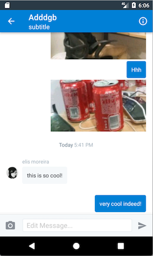
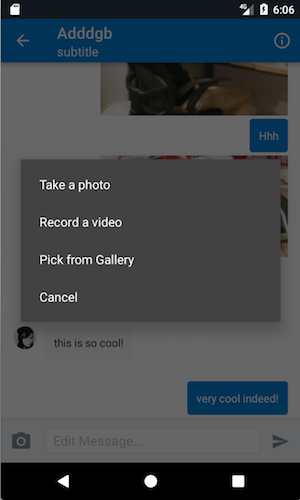
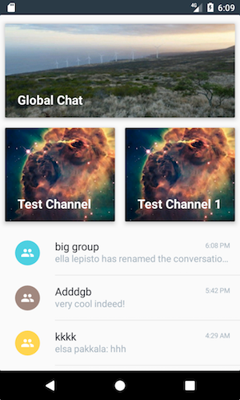

# Integrating AppFriends UI into your application
AppFriends Android SDK provides a full suite of ready-to-use UI components for simplified UI integrations.

There are 3 UI integration modes, in order to decreasing difficulty but increased customization:
## 1. Simple / Standalone Mode (Recommended)
Launching standalone AppFriends UI after a user has logged in, this will launch the full AppFriends UI with channel, group and private conversation views in separate activities (fullscreen or partial slide out).
```
Intent intent = new Intent(getContext(), ConversationsActivity.class);
startActivity(intent);
```

## 2. Embedded Mode
It is also possible to embed AppFriends UI components into your existing application UI flow such as fragments. The AppFriends views all have integrated SDK linking thus reducing the need for you to connect with the core network and caching SDK.

### Chat View
The chat view which displays the conversation and allows the user to type and send different types of messages. For public channel chat and private chat, we have two different view controller classes for you to use.  

### Private Dialogs
For private chat including 1:1 chat and private group chat, the main class is `DialogActivity`. This activity offers typing indicator display, text input, media message input and messages display.




Before entering a dialog view, you must create the dialog. Then you can pass the dialog ID to the `DialogActivity`:
```Java
String dialogId = "a dialog's id";

Intent intent = new Intent(this, DialogActivity.class);
intent.putExtra(DialogActivity.EXTRA_DIALOG_ID, dialogId);
startActivity(intent);
```

### Public Channel chat
For public channel chat, the main class is `ChannelActivity`. This activity offers typing indicator display, text input, media message input and messages display similar to the Chat View.

```Java
String channelId = "a channel's id";

startActivity(ChannelActivity.actionView(this, channelId));
```

## Dialogs List
You often need a dialogs list to display a user's past conversations so that he can quickly go back to or switch between conversations. The main class is `ConversationsActivity`. In dialog list, we already handle new message badge, message preview and sorting the new dialog on top and etc. To use `ConversationsActivity`, you can similar initialize it programmatically or use xib/storyboard. It will fetch past dialogs of the current user and when new messages are sent to the user, it will show up here.



The following views can be directly embedded into your XML layouts:

- `me.appfriends.ui.dialoglist.DialogListRecyclerView`
- `me.appfriends.ui.channellist.ChannelListRecyclerView`

The chat window is a separate activity that you can either launch or extend called `DialogActivity`.

Our sample app also provides extensive details on how to embedded these UI components.

## 3. Custom Mode
If components supplied by the AppFriends UI SDK does not meet your needs, you may elect not to use the UI library and directly interact with the core library. To do so, replace `compile 'me.appfriends.sdk:ui:3.2.2'` with `compile 'me.appfriends.sdk:core:3.2.2'` in your `build.gradle` configuration file. The core SDK provides no UI elements but contains full asynchronous network, caching and persistence functionalities.