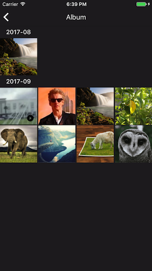

# What is Album?
An album is a place where we group all the images and videos sent within a dialog. All dialogs have album, except the open channels. The purpose of an album is to help user quickly browse through the past media sent within a dialog. If you use our iOS UI SDK, there is built-in Album view available to use.



# Album APIs
There are some very simple API to use for interacting with Album.

## Fetching Album Items
You can get album items using the `AFAlbum` API:

```swift
/// fetch all album items
///
/// - Parameters:
///   - id: the id of the dialog containing the album items you are fetching
///   - time: the earliest time that you want to fetch from
///   - completion: completion block. Returns an array of album items if the request is successful
AFAlbum.getAllAlbumItems(fromDialog: id, startingFrom: time, completion: { (items, error) in
      if error != nil {
        // handle error
      } else {
        // fetch successful
      }
})
```
