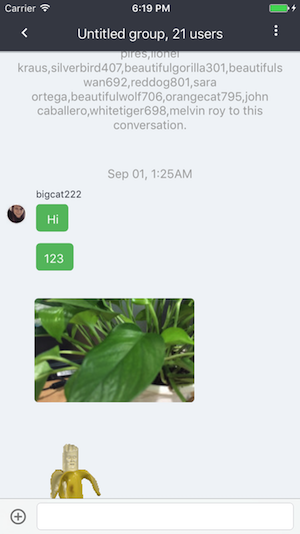
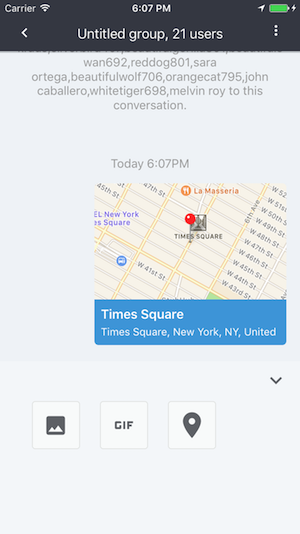
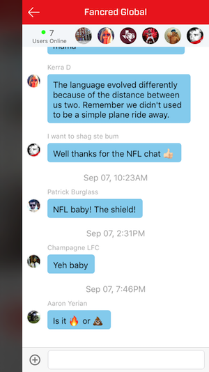
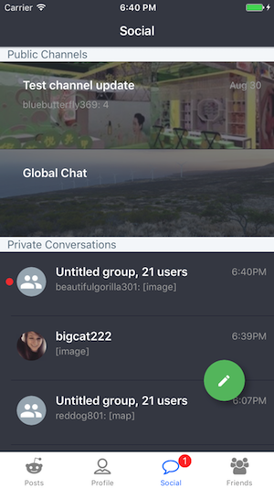

# UI Components
In AppFriendsUI SDK, there are many ready to use UI components for you to save you a great deal of development time. To learn how to customize the UI, please read [ui customization](ui_customization.md). If more advanced customization is needed, you could subclass the existing UI components to change its default behavior.

## Chat View
The chat view which displays the conversation and allows the user to type and send different types of messages. For public channel chat and private chat, we have two different view controller classes for you to use.  

### Private Dialogs
For private chat including 1:1 chat and private group chat, the main class is `HCDialogChatViewController`. This view controller offers typing indicator display, text input, media message input and messages display.




Before entering a dialog view, you must create the dialog. Then you can pass the dialog ID to the `HCDialogChatViewController`:
```swift
// 1:1 chat, you can create a dialog, you can use the target user id.
AFDialog.createIndividualDialog(withUser: userID, completion: { (dialogID, error) in
  if error != nil {
    // handle error here
  } else if let id = dialogID {
    let dialogVC = HCDialogChatViewController(dialogID: id)
    self.navigationController?.pushViewController(dialogVC, animated: true)
  }
})

// private group chat, you can create a dialog, you can pass your own dialog id.
// If you want AppFriends to create a dialog id for you, you can simply pass nil.
// Then you pass the ids of the members.
AFDialog.createGroupDialog(dialogID: nil, members: users, completion: { (id, error) in
  if error != nil {
    // handle error here
  } else if let dialogID = id {
    let dialogVC = HCDialogChatViewController(dialogID: id)
    self.navigationController?.pushViewController(dialogVC, animated: true)
  }
})
```

### Public Channel chat
For public channel chat, the main class is `HCChannelChatViewController` This view controller offers typing indicator display, text input, media message input and messages display.



```swift
// similar to private chat, you need to pass channel dialog id to initialize channel chat view
let channelChatVC = HCChannelChatViewController(dialogID: dialogID)
```

## Dialogs List
You often need a dialogs list to display a user's past conversations so that he can quickly go back to or switch between conversations. The main class is `HCDialogsListViewController`. In dialog list, we already handle new message badge, message preview and sorting the new dialog on top and etc. To use `HCDialogsListViewController`, you can similar initialize it programmatically or use xib/storyboard. It will fetch past dialogs of the current user and when new messages are sent to the user, it will show up here.



## Album
When users send images/videos in a conversation, they often want to have an easier way to browse all of them. For that, we have a `HCAlbumViewController` class.

```swift
// Albums are grouped by dialogs. To initialize, you need to pass a dialog id.
let albumVC = HCAlbumViewController(dialogID: dialogID)
```


