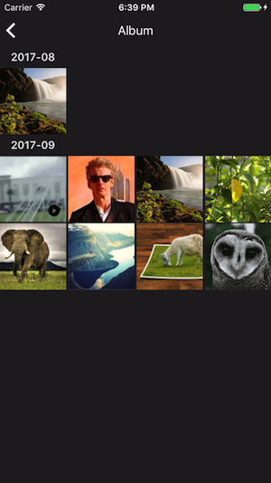

# What is Album?
An album is a place where we group all the images and videos sent within a dialog. All dialogs have album, except the open channels. The purpose of an album is to help user quickly browse through the past media sent within a dialog.



# Album APIs
There are some very simple API to use for interacting with Album.

## Fetching Album Items
```javascript
/// - Parameters:
///   - dialogID: the id of the dialog containing the album items you are fetching
///   - start: the earliest time that you want to fetch from
AppFriends.album.getAlbumItems(dialogID, start)
.then((items) => {
    // items
}, (error) => {
    // failed to get items
});
```
