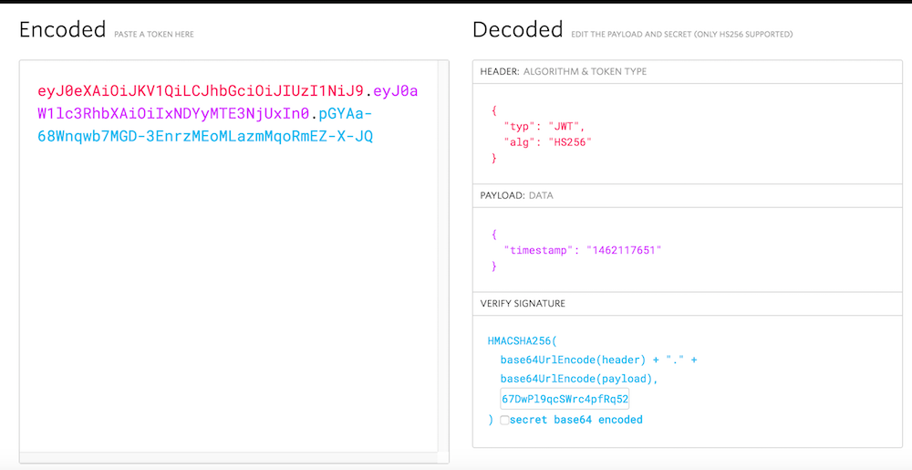

# Authentication and API Requests

When you access AppFriends REST API via our SDK, you only need to provide the correct **App_ID** and **App_Secret** when you initialize the SDK. However, when you want to make direct REST API requests using a http client, the requests need to be structured correctly and signed by the appropriate secret. 

## Request Header
In the request http header, These fields need to be present:

`APP_ID` - Your App_ID. You can find it in the admin panel after your app is created there.

`TOKEN` - When you are sending the requests on a user's behave, the user's auth token should be included here. Auth token is returned after the user signup or login to AppFriends. See [user authentication](#user-authentication).

`Authorization` - Your request signature. See [signature creation](#signature-creation).

### Sample Request Header
Your http header can contain other fields, but they need to include:

```
APP_ID: "SVXJKXjXUGOkEFBWDK8NCwtt"
TOKEN: "BE82LbEu_bGNnwXmy5KObw"
Authorization: Bearer <signature token>
```

## App ID and Secrets
For each application you create on AppFriends, there's going to an **App_ID**, an **App_Secret** and an **Admin_Secret**. 

`App_ID` is used to identify your application.

`App_Secret` is the secret used to sign the requests coming from your application. 

`Admin_Secret` is the secret used to sign the requests coming directly from your server. For example, your server can send a request via AppFriends REST API to update a user's token or you can export all the social graph data with your admin secret.

These values play very important role in authenticating your requests, so please keep them away from the bad guys. 

## Signature Creation
The signature is creation is using JSON Web Tokens [(JWT)](https://jwt.io/), which is an open, industry standard [RFC 7519](https://tools.ietf.org/html/rfc7519) method for representing claims securely between two parties. You can use [this website](https://jwt.io/) to verify your signature.

```javascript
//signature creation
HMACSHA256(
  base64UrlEncode(JWT header) + "." +
  base64UrlEncode(payload),
  <your secret here>
)
```
The signature created here will be used in the Authorization header using the Bearer schema.

	Authorization: Bearer <signature token>
	
### JWT Header
JWT header is not your request http header. It is used just to sign the request. The JWT header will look like this:

```json
{
  "alg": "HS256",
  "typ": "JWT"
}
```
### JWT Payload
Put timestamp (seconds) in your payout
```json
{
  "timestamp": "1462117651"
  "token": 
}
```



*Above: JWT example on [jwt.io](https://jwt.io/)*

## User Authentication
### Create a User
Users on AppFriends are simply mirror images or copies of users in your app. There are two ways to create users on AppFriends, **sign up user in the app** or **batch create users using the admin api**. To create a user, you need to provide the user's id and user name. There are other optional properties of the user you can provide, such as email, avatar(recommend) and real name:

### Sign-up or Sign-in user in the app
In your app, call the SDK's login method.

#### Objective-C
```objc
[HCWidget.sharedWidget loginWithUserInfo:@{
                       kHCUserName: @"(user name)",
                       kHCUserAvatar: @"(user avatar url)",
                       kHCUserID: @"(user id)",
                       kHCUserEmail: @"(user email)"
                      } completion:nil];
```

#### Swift
```swift
HCWidget.sharedWidget().loginWithUserInfo(
                    [
                            kHCUserName: "(user name)",
                            kHCUserAvatar: "(user avatar url)",
                            kHCUserID: "(user id)"
                    ]) { (success, error) in
                        
                    }
```

#### Android
```java
```

#### Batch create user using the admin api
With [admin API](api/#admin-apis), you can batch create users.


  